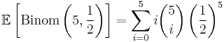
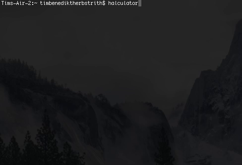

# halculator
A simple RPN calculator written in Haskell
---

Ever wanted to find the expected number of heads when 
tossing 5 coins, i. e., computing

,

using an [RPN](https://en.wikipedia.org/wiki/Reverse_Polish_notation) calculator? Now you can!

## Index
* [**Main**](docs/Main.html) Implementation details of the backbone of the executable
* [**Function index**](functions.html) Supported functions of halculator