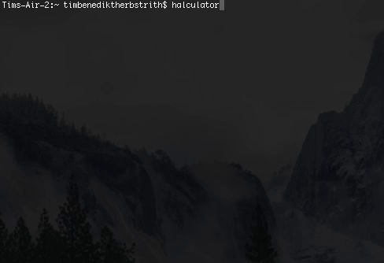

Ever wanted to find the expected number of heads when
tossing 5 coins, i. e., computing

$$ \mathrm E \left[\mathrm{Binom}\left(5, \frac 12\right)\right] =
   \sum_{i = 0}^5 i {5 \choose i} \left(\frac 12\right)^i, $$

using an [RPN](https://en.wikipedia.org/wiki/Reverse_Polish_notation) calculator? Now you can!

## Installation

Clone my [github repository](https://github.com/tim6her/halculator):

    git clone https://github.com/tim6her/halculator.git
    cd halculator

And run the following commands:

    runhaskell Setup configure
    runhaskell Setup build

On a Unix or Linux system:

    sudo runhaskell Setup install

Windows (login with administrator rights):

    runhaskell Setup install

See <https://wiki.haskell.org/Cabal/How_to_install_a_Cabal_package> for further details.
